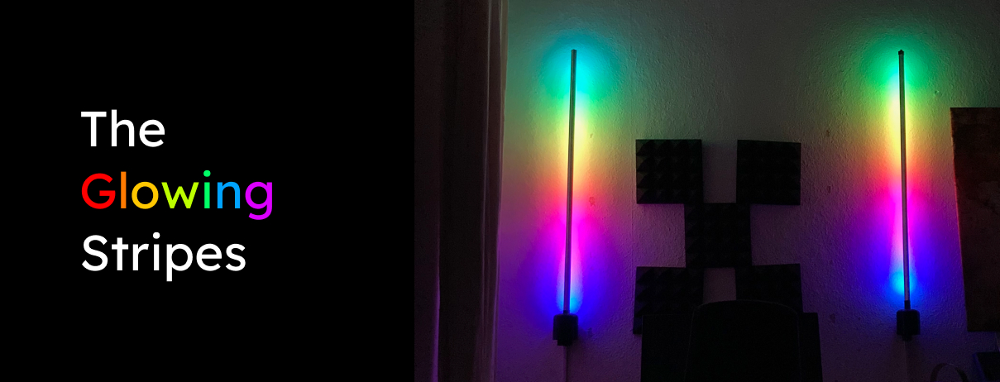
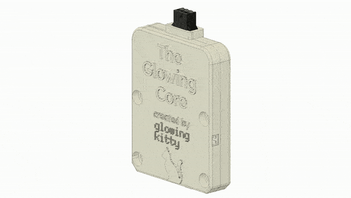
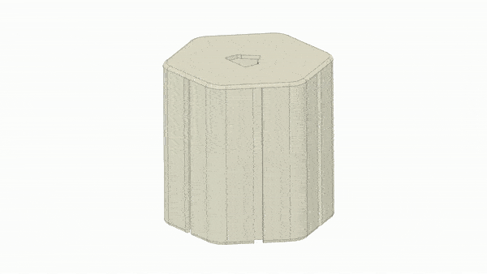
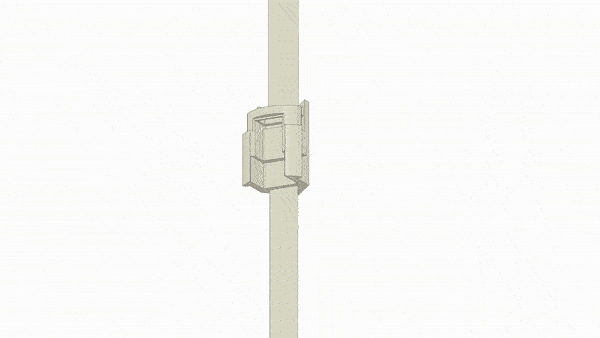
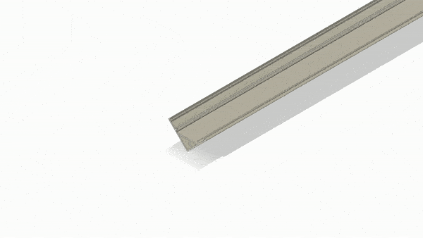
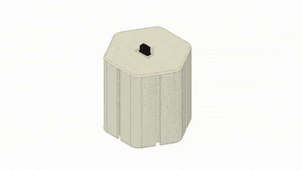
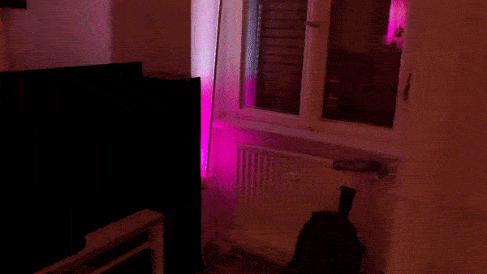

## What is this project?

An LED strip system which can be used to light up your home, a house party or even an outdoor party - with it's integrated battery. Every Glowing Stripes unit can glow for many hours in battery mode - or non stop if connected to a power source at home. And with the integrated microphone it's awesome for setting the mood at your home- or openair-party!

How does one control the LED animations, you ask? By accessing the "Glowing Core" interface via your web browser or WLED app for iOS and Android. "The Glowing Core" is a tiny hardware package to control LED strips by the way - and used inside "The Glowing Stripes". [Check out the readme](https://github.com/glowingkitty/TheGlowingCore) to learn more about that project.

## Known issues

Adding a single 1 meter long LED strip (or shorter) to one base unit works perfectly fine. However, when adding multiple LED strips on top of each other, you might notice the LED strips are bending - depending on what kind of material you use for 3D printing the parts. If you 3D print the connecting people out of metal, you shouldn't have to worry. Otherwise it's wise to limit the length to 1 meter per base unit.

## How to build the Glowing Stripes

### **Step 1:** Build the Glowing Core

Check out [the detailed description here](https://github.com/glowingkitty/TheGlowingCore#how-to-build-the-glowing-core) to learn how to build it.

### **Step 2:** 3D print all needed parts

The design was made for printing on an SLA printer (resin 3D printer). But it should also work perfectly fine with an FDM (molten plastic) 3D printer.

Download and print those STL files:

- 1x [main case](https://github.com/glowingkitty/The-Glowing-Stripes-Project/blob/master/3d%20printed%20parts/main_case/main_case.stl)
- 1x [outer case](https://github.com/glowingkitty/The-Glowing-Stripes-Project/blob/master/3d%20printed%20parts/main_case/outer_case.stl)
- 1x [female a connector](https://github.com/glowingkitty/The-Glowing-Stripes-Project/blob/master/3d%20printed%20parts/connector/female_a.stl)
- 1x [female b connector](https://github.com/glowingkitty/The-Glowing-Stripes-Project/blob/master/3d%20printed%20parts/connector/female_b.stl)
- 1x [male a connector](https://github.com/glowingkitty/The-Glowing-Stripes-Project/blob/master/3d%20printed%20parts/connector/male_a.stl) (make sure to use a very strong filament, resin or best: 3d print it with metal)
- 1x [male b connector](https://github.com/glowingkitty/The-Glowing-Stripes-Project/blob/master/3d%20printed%20parts/connector/male_b.stl)

And depending on how you want to position "The Glowing Stripes"...

Stand on furniture or the ground, indoor:

- 1x [mini stand](https://github.com/glowingkitty/The-Glowing-Stripes-Project/blob/master/3d%20printed%20parts/stand/mini_stand.stl)

Hang on the wall:

- 1x [wall stand](https://github.com/glowingkitty/The-Glowing-Stripes-Project/blob/master/3d%20printed%20parts/stand/wall_stand.stl)

Stand outdoor:

- 3x [stand](https://github.com/glowingkitty/The-Glowing-Stripes-Project/blob/master/3d%20printed%20parts/stand/stand.stl)

### **Step 3:** Get all the other parts you need

Here is what you need:

- 1x [22AWG JST Connector 3-Pin Male](https://aliexpress.com/item/1005001779302510.html)
- 1x [22AWG JST Connector 3-Pin Female](https://aliexpress.com/item/1005001779302510.html)
- 1x [V shape aluminium profile - 50cm or 1m](https://aliexpress.com/item/1005002834175693.html)
- 1x [WS2812B LED strip, 30 LEDs per meter, white - 50cm or 1m](https://aliexpress.com/item/2036819167.html)
- (optional) 1x [3000mAh lipo battery](https://www.amazon.de/-/en/Seamuing-Protective-Insulation-Connector-Development/dp/B08V11Z88Q)
- 4x M3 14mm screws
- 4x M3 square nuts

### **Step 4:** Connect The Glowing Core to main case

Add the M3 nuts into the main case, place the Glowing Core in it and screw it together. Optionally: place the 3000mAh lipo inside as well and connect it with The Glowing Core.

### **Step 5:** Finish base unit

Addd M3 nuts into the outer case, place it on top of the main case and screw it together.

### **Step 6:** Build the connectors

Place the male 3-pin connector into the male connector a, close it with male connector b and repeat the same for the female connector.

### **Step 7:** Complete the LED strips

Tape the LED strips on the aluminium profile & remove the foil from the aluminium profile cover, place the connectors on the two ends of the profile and then solder the wires to the LED strips. Make sure the male connector gets soldered to the beginning of the LED strip! Pay attention to the arrow on the WS2812B LED strip (it must point away from the connector). Remove the transparent foil from the aluminium profile diffuser. Then cover the aluminium profile with the diffuser.

### **Step 8:** Complete the Glowing Stripes

Place the LED strip on the base unit & place the base unit on the stand of your choice.

### **Step 9:** Turn it on and let it glow!

